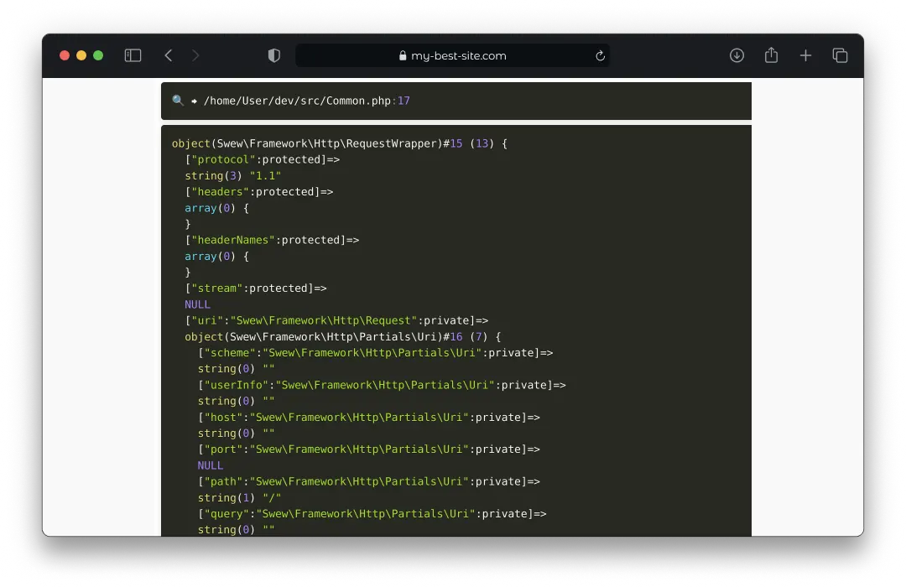

# Swew/dd

The simplest way to debug variables. As in Laravel.

---

# Packages developed by SWEW

> - [swew/cli](https://packagist.org/packages/swew/cli) - A command-line interface program with formatting and text entry functions.
> - [swew/test](https://packagist.org/packages/swew/test) - A test framework that is designed to fix the fatal flaw of other test frameworks.
> - [swew/db](https://packagist.org/packages/swew/db) - A lightweight, fast, and secure PHP library for interacting with databases, creating migrations, and running queries.
> - [swew/dd](https://packagist.org/packages/swew/dd) - The simplest way to debug variables. As in Laravel.

---




# Installation

```sh
composer require swew/dd
```

# Usage

```php
d($v);   // Dump and continue
dd($v);  // Dump and exit
dds($v); // Dump, get short stack trace and exit
ddt($v); // Dump, get full stack trace and exit

```